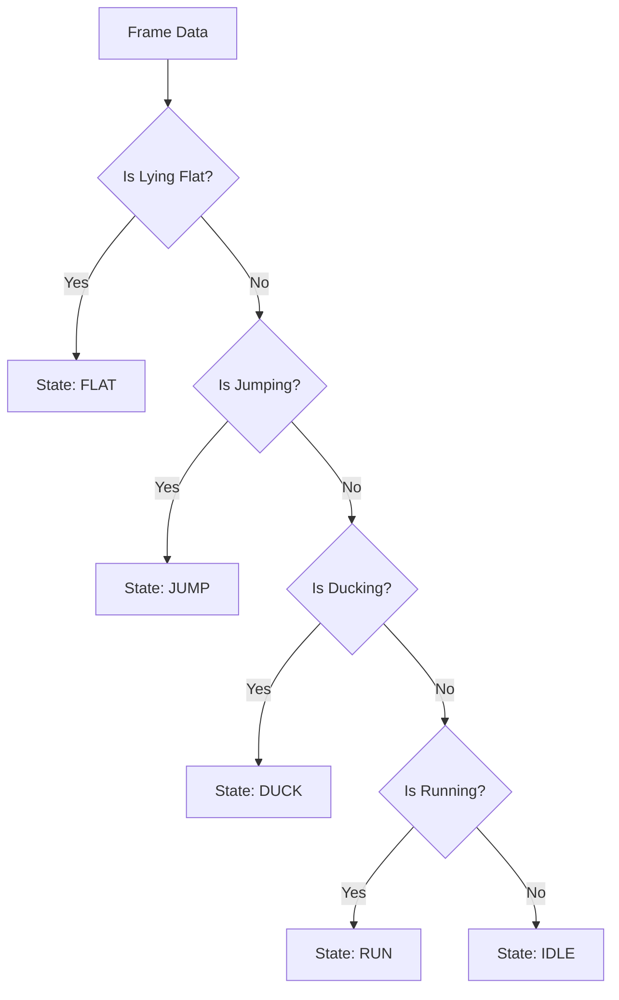

# MOTION_LOGIC.md: Advanced Gesture Recognition for Toddlers

## 1. The Core Challenge: Scale & Perspective

Since the user (child) may move closer/further, **NEVER** use raw pixels (e.g., `if y < 300`).

* **The "Unit of Measure" ():**
* In every frame, calculate .
* All thresholds must be multipliers of  (e.g., `JumpThreshold = 0.5 * U`).

## 2. Refined Action Detection (The "High Knees" Algorithm)

### A. Running (The "Alternating Piston" Check)

* **Why:** A child's "run" is often just marching high knees. Hip oscillation is too subtle/noisy.
* **Detection Logic:**
1. Calculate the **Relative Knee Height** () for both legs:
* 
* 

2. **The Trigger:**
* State is `RUNNING` if: ( AND ) OR ( AND ).

3. **Robustness (Anti-Jump):**
* If **BOTH** knees are up ( AND ) simultaneously, this is **NOT** a run (it’s likely a Jump).

### B. Jumping (The "Whole Body Lift" Check)

* **Why:** We must distinguish a jump from a "vigorous run step."
* **Detection Logic:**
1. Monitor the **Mid-Hip Y-Coordinate**.
2. **The Trigger:**
* State is `JUMPING` if: `MidHip.y` moves UP by  within 0.2 seconds.

3. **Robustness (Landing Protection):**
* Upon landing (Hip returns to baseline), apply a **500ms Lockout** on "Ducking." (Toddlers land deeply, looking like a crouch. This prevents accidental ducks).

### C. Ducking (The "Compactness" Check)

* **Why:** A child might just lean forward instead of squatting.
* **Detection Logic:**
1. Calculate **Body Height** ().
2. **The Trigger:**
* State is `DUCKING` if: .

3. **Robustness:** * The **Spine Angle** (Line from Hip to Shoulder) must remain roughly vertical ( tilt). If it tilts too much, they are likely doing the "Lying Flat" gesture.

### D. Lying Flat (The "Rocket Dodge") - **NEW**

* **Why:** To dodge high-flying rockets.
* **Detection Options (Hierarchical):**
1. **Option A: The "Disappear" Check (Simplest):**
* If `MidHip.y` drops below the bottom 10% of the screen ( height), assume they hit the floor.

2. **Option B: The "Spine Orientation" Check (More Accurate):**
* Calculate the angle of the Spine Vector (MidHip  MidShoulder).
* **The Trigger:** State is `FLAT` if Spine Angle >  (User is horizontal) OR if the Aspect Ratio of the bounding box (Width/Height) > 1.5.

---

## 3. The "Priority State Machine"

To prevent glitches (e.g., detecting a "Run" while "Jumping"), implementing this hierarchy is mandatory:

**Developer Note:** The State Machine locks the output. If `State == JUMP`, do not process Run/Duck logic until the user lands.

---

## 4. Troubleshooting for the 4-Year-Old User

* **The "Closer/Further" Problem:** * *Solution:* Recalculate  (Nose-to-Hip distance) continuously using a **Running Average** (last 30 frames). This adapts if the child slowly walks closer to the screen.
* **The "Waddle" Problem:** * *Solution:* A child might run with legs wide apart. Do NOT use x-axis movement for running detection, only Y-axis Knee Lift.

